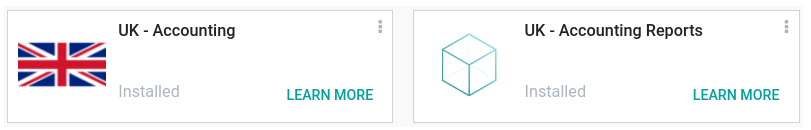

==============
United Kingdom
==============

Configuration
=============

:ref:`Install <general/install>` the following modules to get all the features of the UK
localization. Installing the module :guilabel:`UK - Accounting Reports` installs all two modules at
once.

.. list-table::
   :header-rows: 1

   * - Name
     - Technical name
     - Description
   * - :guilabel:`UK - Accounting`
     - `l10n_uk`
     -  - CT600-ready chart of accounts
        - VAT100-ready tax structure
        - Infologic UK counties listing
   * - :guilabel:`UK - Accounting Reports`
     - `l10n_uk_reports`
     -  - Accounting reports for the UK
        - Allows sending the tax report via the MTD-VAT API to HMRC.

.. note::
   Only UK-based companies can submit reports to HMRC.

.. seealso::
   - `HM Revenue & Customs <https://www.gov.uk/government/organisations/hm-revenue-customs/>`_
   - `Overview of Making Tax Digital <https://www.gov.uk/government/publications/making-tax-digital/overview-of-making-tax-digital/>`_

Chart of accounts
=================

The chart of accounts is installed by default as part of the set of data included in the
:guilabel:`UK - Accounting` module. You can find it by going to :menuselection:`Accounting -->
Configuration --> Accounting: Chart of Accounts`.

Choose how you want to setup your :abbr:`CoA (chart of accounts)` by going to
:menuselection:`Accounting --> Configuration --> Settings --> Accounting Import section`. You can
:guilabel:`Review Manually (end of year balance)` or :guilabel:`Import (for full history)` your
initial balances.

We recommend importing your initial balances using the chart of account import.

Taxes
=====

As part of the localization module, UK taxes are created automatically with their related financial
accounts and configuration.

Go to :menuselection:`Accounting --> Configuration --> Settings --> Taxes section` to update the
:guilabel:`Default Taxes`, the :guilabel:`Tax Return Periodicity` or to :guilabel:`Configure your
tax accounts`.

To edit existing taxes or to :guilabel:`create` a new tax, go to :menuselection:`Accounting -->
Configuration --> Accounting: Taxes`.

.. seealso::
   - :ref:`Taxes <Taxes>`
   - Tutorial: `Tax report and return <https://www.odoo.com/slides/slide/tax-report-and-return-1719?fullscreen=1>`_.

Making Tax Digital (MTD)
------------------------

In the UK, all VAT-registered businesses are required to follow the MTD rules by using software to
submit their VAT returns.

The **UK - Accounting Reports** module enables you to comply with the `HM Revenue & Customs
<https://www.gov.uk/government/organisations/hm-revenue-customs/>`_ requirements regarding
`Making Tax Digital <https://www.gov.uk/government/publications/making-tax-digital/overview-of-making-tax-digital/>`_
in the UK.

.. important::
   If your periodic submission is more than three months late, it is no longer possible to submit
   your report through Odoo. Odoo only retrieves open bonds from the last three months. Your
   submission has to be done manually by contacting HMRC.

Register your company to HMRC before the first submission
~~~~~~~~~~~~~~~~~~~~~~~~~~~~~~~~~~~~~~~~~~~~~~~~~~~~~~~~~

Go to :menuselection:`Accounting --> Reporting --> Tax report` and click on
:guilabel:`Connect to HMRC`. You are now on the HMRC platform and must enter your company
information. This should be done once.

.. Note::
   When entering your VAT number, do not add the GB country code. Only the 9 digits are required.

Periodic submission to HMRC
~~~~~~~~~~~~~~~~~~~~~~~~~~~

Import your obligations HMRC, filter on the period you want to submit, and send your tax report by
clicking :guilabel:`Send to HMRC`.

Periodic submission to HMRC for multi-company
~~~~~~~~~~~~~~~~~~~~~~~~~~~~~~~~~~~~~~~~~~~~~

Only one company and one user can connect to HMRC simultaneously. If several UK-based companies are
on the same database, the user who submits the HMRC report must follow these instructions before
each submission:

#. Log into the company for which the submission has to be done.
#. Go to :guilabel:`General Settings` and in the :guilabel:`Users` section click
   :guilabel:`Manage Users`. Select the user who will submit the VAT return.
#. Go to :guilabel:`UK HMRC Integration` tab and click :guilabel:`Reset Authentication Credentials`
   or :guilabel:`Remove Authentication Credentials` button. Then click again to create new
   credentials. It is now possible to submit the tax report for this company.
#. Repeat the steps for other companies' HMRC submissions.

.. note::
   During this process, the :guilabel:`Connect to HMRC` button no longer appears for other UK-based
   companies.
