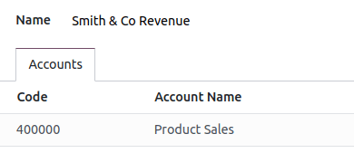

=========================
Manage a financial budget
=========================

Managing budgets is an essential part of running a business. Budgets help people become more
intentional with how money is spent and direct people to organize and prioritize their work to meet
financial goals. They allow you to plan your desired financial outcome and then measure your actual
performance against the plan. Odoo manages budgets using both general and analytic accounts.

Configuration
=============

Go to :menuselection:`Accounting --> Configuration --> Settings --> Analytics` and enable
:guilabel:`Budget Management`.

Budgetary positions
-------------------

Budgetary positions are lists of accounts for which you want to keep budgets (typically expense or
income accounts).

To define budgetary positions go to :menuselection:`Accounting --> Configuration --> Budgetary positions`.

Each budgetary position can have any number of accounts from the chart of accounts, though it must
have at least one.

Use case
========

Let’s illustrate this with an example: we just started a project with Smith & Co, and we would like
to budget the income and expenses of that project.

We plan to have a revenue of 1000, and we don’t want to spend more than 700.

First, we need to define what accounts relate to our project’s expenses. Go to
:menuselection:`Accounting --> Configuration --> Budgetary positions` and :guilabel:`Create` a
position and add the accounts wherein we will book our expenses.

.. image::  budget/smith-and-co-expenses.png
  :align: center

Now, let's repeat the steps to create a budgetary position that reflects the revenue.

Analytical accounts
-------------------

Odoo needs to know which costs or expenses are relevant to a specified budget because the above
general accounts may be used for various different projects.
To do so we need to link our invoices and expenses to a defined analytical account:
Go to :menuselection:`Accounting --> Configuration --> Analytic Accounts` and :guilabel:`Create` a
new :guilabel:`Analytic Account` called Smith & Co.

Each budgetary position can have any number of accounts from the general 
ledger (the main chart of accounts) assigned to it, though it must have at least one.  

Define the budget
-----------------

Let’s now set our targets. We specified that we expect to gain 1000 with this project and we would
like not to spend more than 700. Go to :menuselection:`Accounting --> Budgets` and :guilabel:`Create`
a new budget.

First, fill in your :guilabel:`Budget Name`. Then, select the :guilabel:`Period` wherein the budget
is applicable. Next, add the :guilabel:`Budgetary Position` you want to track, define the related
:guilabel:`Analytic Account`, and add the :guilabel:`Planned Amount`.

.. image:: define-the-budget.png
   :align: center

.. Note::
   When recording a planned amount related to expenses, the amount must be negative.

Check your budget
-----------------

You can check your budget at any time to see how it evolves.

.. tip:: If you use analytical accounts remember that you need to specify this analytic account in
   the invoice and/or purchase line.

.. seealso:: For more information about booking invoices and purchase orders see Invoicing processes

Go back in the budget list and find the Smith & CO Project.

.. note::
   - The :guilabel:`Theoretical amount` represents the amount of money you theoretically could have spend
or should have received in function of the date.

When your budget is 1200 for 12 months (january to december), and today is 31 of january, the
theoretical amount will be 100, since this is the actual amount that could have been realised.
- The :guilabel:`Practical amount` evolves when a new journal entry related to an accounts from your
budgetary position and your analytic account.
