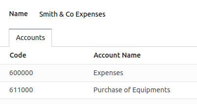
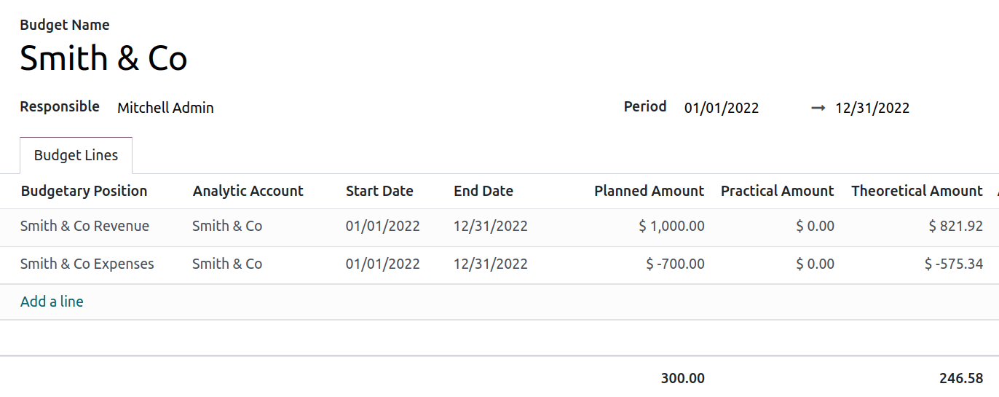

================
Financial budget
================

Managing budgets is an essential part of running a business. Budgets help people become more
intentional with how money is spent and direct people to organize and prioritize their work to meet
financial goals. They allow the planning of a desired financial outcome and then measure the actual
performance against the plan. Odoo manages budgets using both **general** and **analytic accounts**.

Configuration
=============

From the Accounting app, go to :menuselection:`Configuration --> Settings --> Analytics section` and
enable :guilabel:`Budget Management`.

Budgetary positions
-------------------

Budgetary positions are lists of accounts for which you want to keep budgets (typically expense or
income accounts).

To define budgetary positions, go to :menuselection:`Configuration --> Management: Budgetary
Positions` and :guilabel:`New`. Add a :guilabel:`Name` to your budgetary position and select the
:guilabel:`Company` it applies to. Click :guilabel:`Add a line` to add one or more accounts.

.. note::
   Each budgetary position can have any number of accounts from the chart of accounts, though it
   must have at least one.

Use case
========

Let’s illustrate this with an example.

We just started a project with *Smith & Co*, and we would like to budget the income and expenses of
that project. We plan on having a revenue of 1000, and we don’t want to spend more than 700.

First, we need to define what accounts relate to our project’s expenses. Go to
:menuselection:`Configuration --> Management: Budgetary positions`, and click :guilabel:`New` to add
a position. Add the accounts wherein expenses will be booked.

Let's repeat the steps to create a budgetary position that reflects the revenue.

.. image::  budget/smith-and-co-revenue.png
   :align: center
   :alt: display the Smith and Co revenue

Analytical accounts
-------------------

Odoo needs to know which costs or expenses are relevant to a specified budget, as the above general
accounts may be used for different projects. Go to :menuselection:`Configuration --> Analytic
Accounting: Analytic Accounts` and click :guilabel:`New` to add a new **Analytic Account** called
*Smith & Co*.

The :guilabel:`Plan` field has to be completed. Plans group multiple analytic accounts, they are
used to distribute costs and benefits to analyse business performance. :guilabel:`Analytic Plans`
can be created or configured by going to :menuselection:`Configuration --> Analytic Accounting:
Analytic Plans`.

When creating a new customer invoice and/or vendor bill, you have to refer to this analytic account.

.. image:: budget/analytic-accounts.png
   :align: center
   :alt: add analytic accounts in a new invoice or bill.

Define the budget
-----------------

Let’s set our targets. We specified that we expect to gain 1000 with this project, and we would like
not to spend more than 700. Go to :menuselection:`Accounting --> Management: Budgets` and click
:guilabel:`New` to create a new budget for *Smith & Co* project.

First, fill in your :guilabel:`Budget Name`. Then, select the :guilabel:`Period` wherein the budget
is applicable. Next, add the :guilabel:`Budgetary Position` you want to track, define the related
:guilabel:`Analytic Account`, and add the :guilabel:`Planned Amount`.

.. Note::
   When recording a planned amount related to expenses, the amount must be negative.

Check your budget
-----------------

Go to :menuselection:`Accounting --> Management: Budgets` and find the *Smith & Co* Project to see
how it evolves according to the expenses or income for the related analytic account.

The :guilabel:`Practical Amount` evolves when a new journal entry related to an accounts from your
budgetary position and your analytic account is created.

The :guilabel:`Theoretical Amount` represents the amount of money you theoretically could have spent
or should have received based on the date. For example, if your budget is 1200 for 12 months
(January to December), and today is 31 of January, the theoretical amount will be 100, since this is
the actual amount that could have been made.
