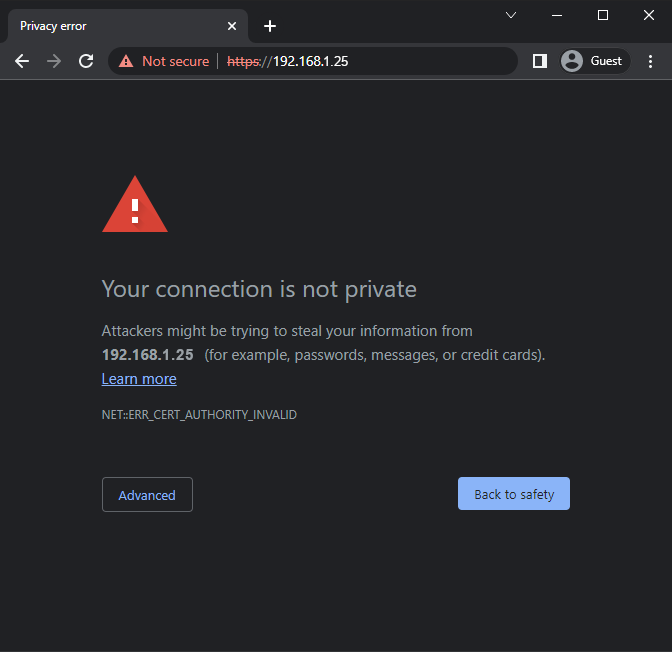

=========================================
Self-signed certificate for ePOS printers
=========================================

ePos printers are designed specifically to work with your Point of Sale system, which sends the
tickets directly to the printer.

Some models don't require an IoT box, but the connection between your web browser and the printer
may require a :doc:`secure connection with the HTTPS protocol <https>`. If so, a self-signed
certificate is necessary to use your printer.

.. note::
   Please check the following list of compatible `Epson ePOS printers
   <https://c4b.epson-biz.com/modules/community/index.php?content_id=91>`_. This list includes the
   following models:

   - TM-H6000IV-DT (Receipt printer only)
   - TM-T70II-DT
   - TM-T88V-DT
   - TM-L90-i
   - TM-T20II-i
   - TM-T70-i
   - TM-T82II-i
   - TM-T83II-i
   - TM-T88V-i
   - TM-U220-i
   - TM-m10
   - TM-m30
   - TM-P20 (Wi-Fi® model)
   - TM-P60II (Receipt: Wi-Fi® model)
   - TM-P60II (Peeler: Wi-Fi® model)
   - TM-P80 (Wi-Fi® model)

Why a self-signed certificate is needed ?
=========================================

With the time, browsers update tend to force the usage of SSL certificate to interact with
printers in the local network for security purposes.

As such if you try to reach the IP address of your printer in HTTPS, you will have a warning page.

    Warning page with Google Chrome on Windows 10

If you then force the connection in :menuselection:`Advanced --> Proceed to 192.168.1.25 (unsafe)`
you will reach the page in HTTPS and be able use the printer in Odoo.

.. warning::

    By doing so, the HTTPS connection is allowed only as long as the browser is open.
    As such, this should be use only as a **workaround** as when the browser will be restarted it
    will again block the page and Odoo.

For a better long term solution, you should import the self-signed certificate of the printer.

Import the printer self-signed certificate
==========================================

Generate a self-signed certificate
----------------------------------

Access your ePOS printer's settings with your web browser by navigating to its IP address, for
example, `http://192.168.1.25`.

.. note::
   - The printer automatically prints the IP address during startup.
   - We recommend assigning a **fixed IP address** to the printer from the network router.

Go to :menuselection:`Authentication --> Certificate List` and create a new **Self-Signed
Certificate**.

- **Common Name**: the IP address of the ePos Printer, for example, `192.168.1.25`
- **Validity Period**: `10`

Create and reboot the printer, go to :menuselection:`Security --> SSL/TLS`, and check if
**Selfsigned Certificate** is selected.

Export and Import the self-signed certificate
---------------------------------------------

Both the export and the import process are heavily dependant on the
:abbr:`OS (Operating System)` that the Odoo device
use and the browser.
The example that will follows are with common :abbr:`OS (Operating System)` and browsers as a guide.

Export the Self-signed certificate
^^^^^^^^^^^^^^^^^^^^^^^^^^^^^^^^^^

.. tabs::

    .. tab:: Chrome

        Access your ePOS printer's settings with your web browser by navigating to its IP address,
        for example, `https://192.168.1.25`. Then, accept the self-signed certificate.

        .. note::
           Note that the protocol is now **HTTPS**.

        Click on :menuselection:`Connection is not secure --> Certificate is not valid`.

        .. image:: epos_ssc/browser-warning.png
           :align: center
           :alt: The web browser indicates that the connection to the printer is not secure.

        Go to the :guilabel:`Details` tab and click on :guilabel:`Export` Select X.509 in
        base 64 and save it.

    .. tab:: Mac OS / iOS (Ipad, IPhone, etc.)

        You can skip this step.

    .. tab:: *Other*

        Type the following keywords in a search engine: `export SSL certificate (name of your
        Operating System (Windows, Ipad, etc.))`

    .. warning::

        Make sure that the certificate end with the extension `.crt`. Otherwise some browser
        might not see it during the import process.

Import the Self-signed certificate
^^^^^^^^^^^^^^^^^^^^^^^^^^^^^^^^^^

.. tabs::

    .. tab:: Windows 10

        For windows, it is the :abbr:`OS (Operating System)` that handles the certificates.

        #. Open the Windows File explorer and locate the downloaded certification file.
        #. Right click on the certification file and choose the option `Install certificate`

            .. image:: epos_ssc/win_install_cert.png
               :align: center

        #. You can decide to install if just for the current logged in user `Current User` or
           all of them `Local Machine`. After that choose `Next`
        #. On the `Certificate Store` panel, make sure to choose
           `Trusted Root Certification Authorities`. After that choose `Next`

            .. image:: epos_ssc/win_cert_wizard_store.png
               :align: center

        #. Press `Finish` when you are done
        #. Restart the computer to make sure that the changes are applied

    .. tab:: Linux

        .. tabs::

            .. tab:: Chrome

                In your Chrome browser, go to :menuselection:`Settings --> Privacy and security -->
                Security --> Manage certificates`

                Go to the :guilabel:`Authorities` tab and click on :guilabel:`Import` and select
                your previous file. Accept all warnings and restart your browser.

    .. tab:: Android

        On your Android device, open the settings and search for *certificate*.
        Then, click on **Certificate AC** (Install from device storage), and select the certificate.

    .. tab:: Mac OS / iOS (Ipad, IPhone, etc.)

        In Mac OS, you can add the certificate from Safari webpage itself.

        #. Access your ePOS printer's settings with Safari by navigating to its IP address in HTTPS,
           for example, `https://10.10.64.196`
        #. On the warning page, click on `Show Details`

            .. image:: epos_ssc/trust-ssl-01.png
                :align: center

        #. On the new message, click on `visit this website`

            .. image:: epos_ssc/trust-ssl-02.png
                :align: center

        #. On the next prompt confirm it with `visit Website`.
           This might prompt you for your password, in this case, do so.

            .. image:: epos_ssc/trust-ssl-03.png
                :align: center

        .. note::

            Even if you had it with Safari, you should be able to use the printer
            with the other installed browser (Chrome, etc.)

    .. tab:: *Other*

        Type the following keywords in a search engine: `import SSL certificate root authority
        (name of your Operating System (Windows, Ipad, etc.))`

Check if the certificate was imported correctly
-----------------------------------------------

Connect back to the IP of your printer in https, for example, `https://192.168.1.25`.
If the certificate is applied, you should no longer have the browser warning page and
you will see in the address bar that the connection is in HTTPS (generally symbolised by a padlock).

    .. figure:: epos_ssc/epos_before_certificate.png
       :align: center

       Address bar before importing the HTTPS certificate (on Chrome)

    .. figure:: epos_ssc/epos_after_certificate.png
       :align: center

       Address bar after importing the HTTPS certificate