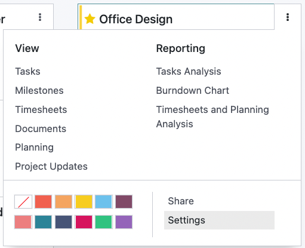
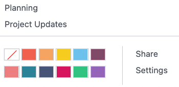

==================
Project management
==================

Odoo Project uses the **Kanban** project management system. This means all projects are broken down
into tasks, which are categorized on a whiteboard according to what production phase they are in.

.. admonition:: Did you know?

   The word **Kanban** comes from Japanese and refers to the "visual board" management method.

.. seealso::
   `Odoo Tutorials: Kanban Project Management
   <https://www.odoo.com/slides/slide/kanban-project-management-1664>`_

Configuration
=============

Open the **Project** app and click :guilabel:`Create` to start a new project. Enter a
:guilabel:`Name` for your project.

Once created, you can customize your existing **projects** from the dashboard by clicking the
:guilabel:`drop-down toggle button (⋮)` on a project's **card**. This enables a new menu under which
users can access :guilabel:`Documents` related to the task, change the **card's** color, and access
further customization options in :guilabel:`Settings`.

Add color to project
--------------------

A project can be made more recognizable by changing the color of its **card**. To do so, click on
the :guilabel:`drop-down toggle button (⋮)` and select a color in the bottom-left of the menu.

Documents
---------

To upload documents to a project, drag and drop the document onto the project's **card**, or go to
:menuselection:`the drop-down toggle button (⋮) --> Documents` and click :guilabel:`Upload`. All
uploaded documents can be found under this menu, as well as in the **Documents** app, under
:guilabel:`Projects`.

.. seealso::
   `Odoo Tutorials: Customize your project
   <https://www.odoo.com/slides/slide/customize-your-project-1662?fullscreen=1>`_

Settings
--------

To access the settings of a project, click on the :guilabel:`drop-down toggle button (⋮)` of the
project's **card**, and then :guilabel:`Settings`. From here, the following settings can be changed:

- :guilabel:`Name` of the project;
- Mark the project as :guilabel:`Favorite`, allowing to find it using the :guilabel:`My Favorites`
  filter on the Kanban view;
- :guilabel:`Name of the tasks` found under that project.
- :guilabel:`Customer` for whom the project is intended;
- the :guilabel:`Tags` used for filtering;
- the :guilabel:`Company` responsible for the project;
- the employee designated as :guilabel:`Project Manager`;
- the :guilabel:`Planned Date` of the project;
- the total :guilabel:`Allocated Hours` for that project.

.. image:: project_management/project-settings-opened.png
   :align: center
   :alt: Project settings

In addition, it is also possible to add a description in the
:guilabel:`Description` tab, and view related :abbr:`SO (Sales Order)` for that project under the
:guilabel:`Invoicing` tab. Under the :guilabel:`Settings` tab, an :guilabel:`analytic Account` for
that project can be set, as well as the :guilabel:`Visibility` parameters.

Further options are also available depending on the other **apps** installed on your database.

.. note::
   Users with the **Invoicing** or **Accounting** app installed also have the option to set
   the project as :guilabel:`Billable`, the **Timesheets** app to log time on tasks within the
   project, and the **Planning** app to plan resources on tasks within the project.

Scheduling activities
=====================

You can schedule **activities** (ex. :guilabel:`Call`, :guilabel:`Meeting`, etc.) per project by
clicking on the **clock** icon on a project. This opens a list with already scheduled activities,
and also allows to add **new** activities by clicking :guilabel:`+ Schedule an activity`. In the
pop-up window, select the :guilabel:`Activity Type`, enter a :guilabel:`Summary` for that activity,
a :guilabel:`Due Date`, and :guilabel:`Assigned to` employee. According to the :guilabel:`Activity
Type`, you may have **additional options** available.

.. note::
   If an activity is **already** scheduled, the icon may change to a **phone**, **group of
   persons**, or other.
