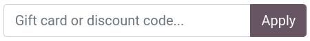
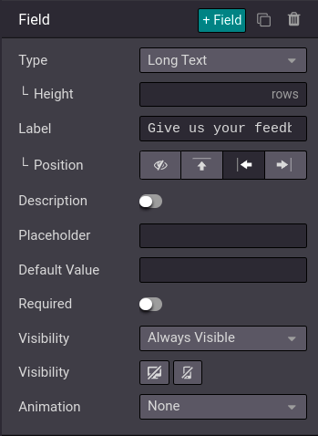
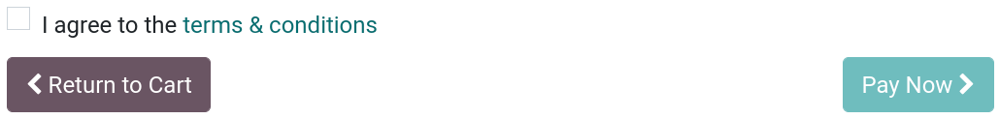

========
Checkout
========

You can customize the checkout process by enabling **additional features** for the different
checkout steps, adding additional content through the **website builder** tool, and enabling other
features such as **express checkout**, or **sign in/up at checkout**.

Checkout steps
==============

Review Order
------------

Promo code
~~~~~~~~~~

If you have enabled :guilabel:`Discounts, Loyalty, & Gift Card` in the settings
(:menuselection:`Configuration --> Settings --> Shop - Products`), you can enable a
:guilabel:`Promo Code` field (:menuselection:`Edit --> Customize`) from any checkout page.
Customers can then redeem gift cards and promotional codes at the :guilabel:`Review Order` step.

Discount subtotal
~~~~~~~~~~~~~~~~~

If :guilabel:`Discounts, Loyalty, & Gift Card` is enabled, you can display the **subtotal** after
discount at the :guilabel:`Review Order` step. From any checkout page, go to :menuselection:`Edit
--> Customize` and enable :guilabel:`Show Discount in Subtotal`.

.. image:: checkout/checkout-subtotal.png
   :align: center
   :alt: Subtotal discount

Address
-------

B2B fields
~~~~~~~~~~

Optional :guilabel:`TIN/VAT` and :guilabel:`Company Name` fields can be added to the
:guilabel:`Billing Address` form for B2B customers. To add the fields, go to :menuselection:`Edit
--> Customize` from any checkout page, and enable :guilabel:`Show B2B fields`.

Request extra info (extra step)
-------------------------------

You can request :guilabel:`Extra Info` from the customer by adding an **extra step** between the
:guilabel:`Address` and :guilabel:`Confirm Order` steps. The :guilabel:`Extra Info` step is an
online form linked to the quotation or sales order of the customer. The information added in the
extra step is available on the quotation or sales order of the customer from the back end, in the
**Sales** app.

When enabled, you can remove, add, and modify fields of the form by clicking on :guilabel:`Edit` in
the top-right corner, and then clicking on any of the form's fields. At the bottom of the
:guilabel:`Customize` menu, under the :guilabel:`Field` section, are all the customization options
for the fields, as well as the :guilabel:`+ Field` button to add additional fields.

Confirm Order
-------------

Terms and Conditions
~~~~~~~~~~~~~~~~~~~~

You can ask customers to agree to the :guilabel:`Terms & Conditions` in order to confirm their order
by enabling :guilabel:`Accept Terms & Conditions` under :menuselection:`Edit --> Customize` on any
checkout page. The :guilabel:`Terms & Conditions` prompt is found on the :guilabel:`Confirm Order`
step.

.. todo:: add section on suggested accessories when that PR is published
.. todo:: add ref to discounts when published

Add content
===========

You can use **building blocks** to add content at any step of the checkout process, including the
**order confirmation** page. To do so, from any **checkout page**, go to :menuselection:`Edit -->
Blocks`, and drag and drop **building blocks** to the page. Note that content is **specific** to
each step.

Express checkout
================

You can enable a :guilabel:`Buy Now` button on products' pages which instantly takes the customer to
the :guilabel:`Confirm Order` checkout page, instead of adding the product to the cart. To do so, go
to :menuselection:`Website app --> Configuration --> Settings --> Shop - Checkout Process section`
and tick :guilabel:`Buy Now`. Alternatively, the :guilabel:`Buy Now` button can also be enabled from
any product's page by going :menuselection:`Edit --> Customize`.

The button can be found next to the :guilabel:`Add to Cart` button on the product's page.

.. image:: checkout/checkout-express.png
   :align: center
   :alt: Buy now (express checkout) button

Guest and signed-in checkout
============================

It is possible to introduce a **checkout policy** under which customers can either checkout as
**guests**, **signed users only**, or **optionally sign up later** to track their order.

To select a policy, go to :menuselection:`Website app --> Configuration --> Settings --> Shop -
Checkout Process`. You can choose between:

.. _mandatory-signup:

- :guilabel:`Optional`: allows guests to checkout and later register from the **order confirmation**
  email to track their order;
- :guilabel:`Disabled (buy as guest)`: customers can only checkout as guests;
- :guilabel:`Mandatory (no guest checkout)`: customers can only checkout if they are signed-up.

B2B access restriction
----------------------

If you wish to restrict checkout only to **selected B2B customers**, enable :ref:`Mandatory (no
guest checkout) <mandatory-signup>` and go to :menuselection:`Website app --> eCommerce -->
Customers`. Select the customer you wish to **grant access to**, click :menuselection:`Action -->
Grant portal access`, and click :guilabel:`Grant Access`.

.. tip::
   Settings are **website-specific**, which means you can set up a B2C website allowing **guest**
   checkout, and another for B2B customers with **mandatory sign-in**.

.. note::
   Users can only have one portal access per **email**. They *cannot* be granted access to two
   different portals with that same **email adresss**.

Shared Customer Accounts
------------------------

If you enable :guilabel:`Shared Customer Accounts` under :menuselection:`Website app -->
Configuration --> Settings --> Privacy section`, you can allow or disallow access to *all* websites
for one same account.
