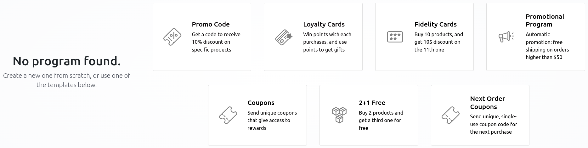
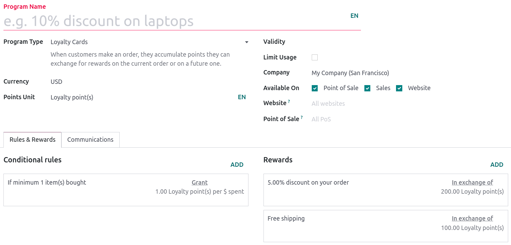
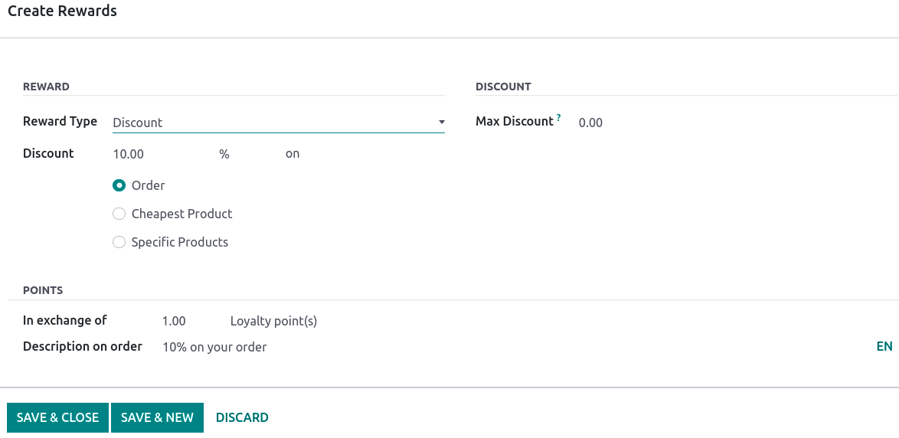

================
Price management
================

Odoo offers multiple options to select the price displayed on your website, as well as
condition-specific prices based on selected criteria.

Tax inclusion
=============

Choosing the displayed price tax usually depends on a country's regulations or the type of customers
**(B2B vs B2C)**. To select the type of price displayed, go to :menuselection:`Website app -->
Configuration --> Settings`, scroll down to the :guilabel:`Shop - Products` category, and select
:guilabel:`Tax Excluded` or :guilabel:`Tax Included`.

Note that this setting is **global**, and the tax-display type is the same for your website(s) and
back-end. It is therefore not possible to select different tax displays for different websites. This
may be a significant point of consideration when implementing a database with multiple ecommerce
websites pertaining to different types of customers (i.e. B2B and B2C).

- :guilabel:`Tax Excluded`: the price displayed on the website is **tax-excluded** and the tax is
  computed at the cart-review step;
- :guilabel:`Tax Included`: the price displayed on the website is **tax-included**.

You can choose to display the type of pricing next to the product price, by going to
:menuselection:`Website app --> Site --> Homepage --> Shop`, selecting one of your product, and then
:menuselection:`Edit --> Customize tab` and enabling :guilabel:`Tax Indication`.

.. image:: price_management/price-tax-display-type.png
   :align: center
   :alt: Tax type displayed on the product page

Price per unit
==============

It is possible to display a
:doc:`price per unit <../../../inventory_and_mrp/inventory/management/products/uom>` on the product
page. To do that, go to :menuselection:`Website app --> Configuration --> Settings` and enable
:guilabel:`Product Reference Price` under the :guilabel:`Shop - Products`. When enabled, make sure
an amount is set in the :guilabel:`Base Unit Count` field of the **product template**, as well as in
the :guilabel:`Sales Price`. The price per unit of measure can be found above the :guilabel:`Add to
Cart` button on the product page.

.. image:: price_management/price-cost-per-unit.png
   :align: center
   :alt: Cost per unit pricing on the product template

.. image:: price_management/price-cost-per-unit-page.png
   :align: center
   :alt: Cost per unit pricing on the product page

.. note::
   Pay attention that having the price per unit may be **mandatory** in some countries.

.. seealso::
   - :doc:`../../../inventory_and_mrp/inventory/management/products/uom`

Price configuration
===================

Pricelists
----------

Pricelists are the main tool to manage prices on your eCommerce. They allow you to define
website-specific prices - different from the price on the product template - based on **country
groups**, **currency**, **minimum quantity**, **period**, or **variants**. You can create as many
pricelists as needed, but it is mandatory to have at least one pricelist available on a website. If
no custom pricelists are added, Odoo defaults to the **Public Pricelist** for all websites.

Configuration
~~~~~~~~~~~~~

Pricelists can be found under :menuselection:`Website app --> eCommerce --> Pricelists`, but must
first be activated. For that, head to :menuselection:`Website app --> Configuration --> Settings`
and scroll down to the :guilabel:`Shop - Products` section. There, you can find two options:

- :guilabel:`Multiple prices per product`;
- :guilabel:`Advanced price rules (discounts, formulas)`.

The **first** option allows you to set different prices per customer *segment*, i.e., registered
customers, gold customers, regular customers, etc. The **second** option allows you to set *price
change* rules such as **discounts**, **margins**, **roundings**, etc.

Foreign currency
~~~~~~~~~~~~~~~~

If you are selling in **multiple currencies** and have pricelists in foreign currencies, customers
can select their corresponding pricelist anywhere on the :guilabel:`Shop` page from the drop-down
menu next to the **search bar**.

.. image:: price_management/price-pricelists.png
   :align: center
   :alt: Pricelists selection

.. seealso::
   - :doc:`../../../sales/sales/products_prices/prices/pricing`
   - :doc:`../../../sales/sales/products_prices/prices/currencies`

Discount and loyalty programs
=============================

Discount and loyalty
--------------------

It is possible to create promotion and loyalty programs, which offer different options from
pricelists. To do so, go to :menuselection:`Website app --> eCommerce --> Discount & Loyalty`, and
:guilabel:`Create` a program from scratch or by using the templates. You can also modify an existing
program by clicking on it.

.. _pricing_management/program-types:

The different program types are:

- :guilabel:`Coupons`: Generate and share single-use, coupon codes that grant access to rewards;
- :guilabel:`Next Order Coupons`: Generate and share single-use, coupons that grant access to
  rewards on the next order;
- :guilabel:`Promotions`: Set conditional rules when ordering, which grant access to rewards for the
  customers;
- :guilabel:`Discount Code`: Set codes which, when entered upon checkout, grants customers a
  discount;
- :guilabel:`Loyalty Cards`: Customers receive points when buying, which they can exchange for
  rewards on their current or future order;
- :guilabel:`Buy X Get Y`: Grant 1 credit for each item bought, then reward customers with Y item in
  exchange of X credits.

Configuration
~~~~~~~~~~~~~

When creating or modifying a program, the options available depend on the :guilabel:`Program Type`
selected. Therefore, some programs may have additional options related to their type.

- :guilabel:`Program Name`: Enter the name of the program, this is not visible by the customer;
- :guilabel:`Program Type`: The :ref:`program type <pricing_management/program-types>` you want to
  use;
- :guilabel:`Currency`: The currency you wish to use for that program;
- :guilabel:`Points Unit`: The unit you wish to use for the :guilabel:`Loyalty Cards`. You are free
  to enter any name you want;
- :guilabel:`Validity`: The date until which the program is valid;
- :guilabel:`Limit Usage`: The limited number of times the program can be used during the
  :guilabel:`Validity`;
- :guilabel:`Company`: If you have multiple companies, the company in which the program is
  available;
- :guilabel:`Available On`: Check the app boxes where the program is available on;
- :guilabel:`Website`: The website(s) on which the program is available. Leave the field to make it
  available on *all* websites;
- :guilabel:`Point of Sale`: The :abbr:`PoS (Point of Sale)` in which the program is available.
  Leave empty to make it available on *all* :abbr:`PoS (Point of Sale)`.

You can see the number of promotional items available per program in the upper-right corner, under
the corresponding tab.

.. image:: price_management/price-programs-items.png
   :align: center
   :alt: Program items tab

Conditional rules
*****************

Under the :guilabel:`Rules & Rewards` tab, you can set the conditions and points value depending on
the program type you selected. Click :guilabel:`Add` in the :guilabel:`Conditional rules` column to
add **conditions**.

- :guilabel:`Minimum Quantity`: The minimum quantity that must be bought to access the reward;
- :guilabel:`Minimum Purchase`: The minimum amount (in currency) :guilabel:`tax Included` or
  :guilabel:`tax Excluded` to access the reward. You can combine both quantity *and* amount;
- :guilabel:`Products`: The product(s) to which the program applies;
- :guilabel:`Categories`: The category of products to which the program applies. Select
  :guilabel:`All` to apply to *all* categories;
- :guilabel:`Product Tag:` Select a tag to apply the program to products containing that tag;
- :guilabel:`Grant`: Set the number of points the customer can earn :guilabel:`per order`,
  :guilabel:`per currency spent`, or :guilabel:`per unit paid`.

.. image:: price_management/price-conditions.png
   :align: center
   :alt: Conditional rules to get rewards through a program type

Rewards
*******

Click :guilabel:`Add` in the :guilabel:`Rewards` column to add **rewards**. According to the type of
reward selected, different options may be available.

- :guilabel:`Reward Type`: Select the reward type among :guilabel:`Discount`,
  :guilabel:`Free product`, and :guilabel:`Free Shipping`;
- :guilabel:`Discount`: The discounted amount in :guilabel:`%`, :guilabel:`currency per point`, or
  :guilabel:`currency per order` on either the :guilabel:`Order`, the :guilabel:`Cheapest Product`,
  or the :guilabel:`Specific Products`;
- :guilabel:`In exchange of`: Enter the amount of tokens or points earned by the customer to be
  exchanged for the reward;
- :guilabel:`Description on order`: The description of the reward displayed upon checkout;
- :guilabel:`Max Discount`: The maximum amount (in currency) granted by the discount. Leave on `0`
  for unlimited amounts;
- :guilabel:`Discounted Products`: The selected product(s) eligible for discount;
- :guilabel:`Discounted Prod. Categories`: The product category eligible for discount. Select
  :guilabel:`All` for all categories;
- :guilabel:`Discounted Prod. Tag`: The products eligible for discount according to their tag.

Permanent discount
------------------

If you have permanently reduced the price of a product, a popular means to attract customers is the
**strikethrough** strategy. The strategy consists in displaying the previous price crossed-out, and
the **new discounted price** next to it.

.. image:: price_management/price-strikethrough.png
   :align: center
   :alt: Price strikethrough

To display a 'striked' price, first enable the :guilabel:`Comparison Price` option under
:menuselection:`Website app --> Configuration --> Settings --> Shop - Products category`. Then, head
to the product's template (:menuselection:`Website app --> eCommerce --> Products`) and in the
:guilabel:`Compare to Price` field, enter the **new** price.
